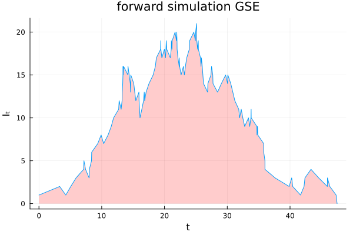

# In search for mixing with PDMP samplers: a case study with stochastic epidemics
*Author(s)*: S. Grazzi
******
This blog post is based on the manuscirpt [Methods and applications of PDMP samplers with boundary conditions](https://arxiv.org/abs/2303.08023) by J. Bierkens, S. Grazzi, M. Schauer, G. Roberts. 
******
*Abstract:* State-of-the-art Monte Carlo methods use the gradient of the log density to explore the space efficiently. These methods cannot generally be used when the density presents discontinuities as the gradient is not defined in those regions.  One exception is the class of Monte Carlo methods developed in [1] based on Piecewise-deterministic Markov processes (PDMP samplers). These samplers are continuous-time and  gradient-based  and are capable of targeting densities which are only piecewise smooth.  In this blog-post, we gloss over many technicalities presented in [1] in view of a gentle introduction and showcase of PDMP samplers for general stochastic epidemic (GSE) models. Similar principles may be applied to more general compartment models with latent state space.
## General stochastic epidemic (GSE) model
Let  $\{Y(t) \in \{S, I, R\}^N, t\ge 0\}$ be a infection process in a population of size $N$. Each coordinate $Y_i(t)$ takes values
$$
y_i(t) = \begin{cases}
    S & \text{if $i$ is susceptible at time $t$},\\
    I & \text{if $i$ is infected at time $t$},\\
    R & \text{if $i$ is removed at time $t$}.\\
\end{cases}
$$
Each coordinate process $t \to Y_i(t)$ is allowed to change state in the following direction:  $S \to I \to R$. In particular the coordinate process changes its state from $S$ to $I$ according to an inhomogeneous Poisson process with rate $t \to \beta I_t$, where $\beta>0$ and $I_t = \sum_{i=1}^N {1}_{(Y_i(t) = I)}$ is the number of infected people in the population at time $t$. The time taken to transition from $I$ to $R$ is assumed to be an exponential r.v. with rate $\gamma>0$. 
Let $I_\infty$, with $|I_\infty| \le N$, the set of indices of infected people before the last infected individual is removed. We assume that at time $0$, $\alpha$ individuals are infected and we observe the epidemic when it is extincted, that is, after the last infected individual has been removed. As it is common for this class of models, we assume we do not observe the infection times (i.e. when the coordinate process changes from $S \to I$) and we only  observe the time where individuals change their state from $I$ to $R$. We assume that $\gamma, \beta$ are unknown. These two parameters are fundamental as they jointly determine the reproduction number $R_0 := \beta N/\gamma$.

We create syntetic data by forward-simulating the model and choosing $N = 200$, $\alpha = 1$, $\beta = 0.01$, $\gamma = 0.15$ ($R_0 = 4/3$). The figure below shows the (unobserved) number of infected individuals as a funciton of time. With these parameters, the epidemic ceases at time $T = 47$ and infected during its course $m = 71$ individuals. 

## Monte Carlo Methods
Denote the infection times $\tau = (\tau_1,\tau_2,\dots,\tau_m)$ of the infected population
The likelihood for $(\gamma, \beta)$ becomes tractable only when $\tau$ is known. Standard Bayesian approaches are based on Data Augmentation, where $(\tau, \gamma, \beta)$ are simulated iteratively by means of MCMC methods. In this case, if we set independent Gamma priors for $\gamma, \beta$, we can derive the posterior of $\tau$ by marginalising $\gamma,\beta$ out. Hence, the  statistical procedure which is investigated here is the following: 
1. Obtain samplers $\tau(1), \tau(2),\dots,\tau(T)$ by a MCMC method targeting the posterior distribution of $\tau$ (marginalised over $\gamma, \beta$).
2. For $i= 1,2,\dots, T$: sample $\gamma, \beta$ conditionally on $\tau(i)$.

The model considered here is one of the simplest epidemic model considered in the literature, however the resulting target measure of the latent infection times $\tau$ (See Appendix A below for its explicit form) already presents several challenges for MCMC methods. 
<!-- 
 
 Click here for an explicit derivation of of the target.
 -->
<!--   [fill with target density] -->
<!-- 
 -->
## Challnges for MCMC methods
The posterior distribution of the latent space of infection times $\tau$ is supported on a  high dimenional orthotope (a 'box') and its density is discontinuous with respect to the order of infection and removal times. Discontinuities disqualifies the use of standard state of the art gradient based MCMC methods such as HMC and MALA. Thus, standard approaches uses a simple RW-Metropolis. For targets supported on orthotope in high dimensions, the mixing time of Metropolis Random Walk significantly deteriorates, departing from order $\scr{O}(d)$ to $\scr{O}(d^2)$, see [3] for details. When it s not possible to integrate out $(\gamma, \beta)$, such as for more complicated (and realistic) epidemic models, we need to sample $\gamma, \beta, \tau$ simultaniously. This introduce further challenges: a widely known challenge for MCMC methods for epidemic models is given by the high dependence between infection times and parameters under the posterior measure. This dependence is induced by the graph of the model and has been studied for example in [2]. Tentative remedies are given by non-centered reparametrizations, when these are available. High dependence may deteriorate the performance of MCMC methods,  in particular of Gibbs samplers for which parameters and latent space of infection times are inputed in alternation and _not_ simultaneously. Finally, the marginal density of $\beta, \gamma$ are light-tailed and are particularly problematic to sample for discrete Markov chain Monte Carlo algorithms whose proposal point is proportional to the gradient such as MALA, ULA and HMC (see for example [4]).
<!-- ## MH algorithm
For the reasons outlined in the previous section, it is common to default to gradient-agnostic MH methods. For example, it is reasonable to propose the following MH routine: for a given initial $\gamma, \tau$ 
1. pick uniformly at random $i \in \{1,2,\dots,m\}$ and propose $\tau_i$ such that $\tau^\circ_i -\tau_i \sim \mathrm{Exp}(\gamma)$. Accept the porposed point with a MH step according to $\pi(\tau)$.
2. update $\gamma \mid \tau$ from its conditional distribution. -->

## Piecewise-deterministic Monte Carlo sampler: in search for mixing time
[FILL IN WITH AN INTRO ON PDMPS]

## Results and comparisons
Here we visually compare the performances a Randow Walk Metropolis algorithm with adaptive stepsize targeting the optimal acceptance rate 0.234 against Zig-Zag sampler. We run the former for 10^4 iteration and the latter for a time horizon T = 10^3. 

For both algorithms we show the traces for $\tau_1, \,\bar \tau = \sum_{i=1}^m \tau_i,\, \gamma, \beta$.

*image_caption*

## Conclusions
[TODO]

## References
[1] Methods and applications of PDMP samplers with boundary conditions, J. Bierkens, **S. Grazzi**, G. O. Roberts, M. Schauer. https://arxiv.org/abs/2303.08023
[2] A case study in non-centering for data augmentation: Stochastic empidemics, P. Neal and G. Roberts. Statistics and Computing 2005.
[3] Optimal scaling of random walk Metropolis algorithms with discontinuous target densities; G. O. Roberts, R. L. Tweedie
[4] Exponential Convergence of Langevin Distributions and Their Discrete Approximations;  P. Neal, G. Roberts, W. K. Yuen 

# Appendix
## A: Target density
Let $\tau^\circ = (\tau_1^\circ, \tau_2^\circ,\dots,\tau_m^\circ)$ the removal times of the infected population. $I_t,S_t$ are respectively the number of infected and susceptible individuals at time $t$. The likelihood of the GSE model is given by 
$$
L(\tau \mid \gamma, \beta) = \prod_{\substack{i=1 \\ i\neq k}}^m \beta I_{\tau_i-} \exp(-\beta \int_{\tau_k}^T I_t S_t \mathrm{d}t) \prod_{i=1}^m \gamma \exp(-\gamma (\tau^\circ_i - \tau_i)).
$$
Let $\pi_\gamma$ and $\pi_\beta$ be the independent priors for $\gamma$ and $\beta$, the posterior for $(\tau, \gamma,\beta)$ is 
$$
\pi(\tau,\gamma, \beta) \propto L(\tau \mid \gamma, \beta)\pi_\beta(\beta)\pi_\gamma(\gamma)
$$

By setting  $\pi_\beta(\cdot) = \mathrm{Gam}(\nu_\beta, \lambda_\beta)$ and $pi_\gamma(\cdot) =\mathrm{Gam}(\nu_\gamma, \lambda_\gamma)$ and integrating out $\gamma, \beta$ we get 
$$
\pi(\tau) \propto (\prod_{\substack{i=1 \\ i\neq k}}^m I_{\tau_i-})(\lambda_\beta + A(\tau))^{-(m + \nu_\beta - 1)} (\lambda_\gamma + \sum_{i=1}^m (\tau_i^\circ - \tau_i))^{-(m + \nu_\gamma)}. 
$$
The first term create discontinuity with respect to the order of the vector $(\tau^\circ, \tau)$ of infection times and removal times.

